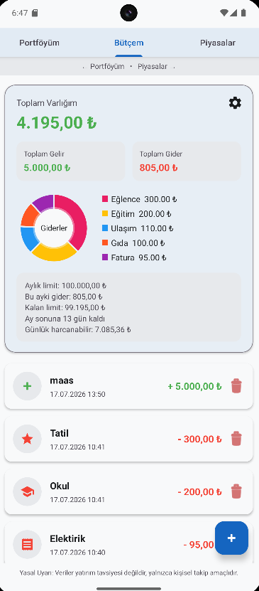
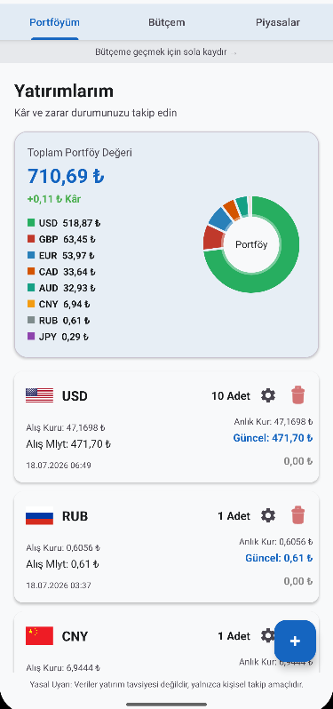
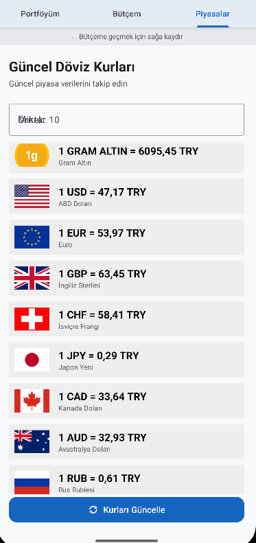

# 🚀 Dijital Cüzdan — Digital Wallet

Dijital Cüzdan; gelir, gider ve yatırımlarınızı takip etmenizi, günlük referans döviz kurlarını görüntülemenizi ve kur hesaplamaları yapmanızı sağlayan modern bir Android uygulamasıdır.

Uygulama; kişisel finans yönetimi, portföy takibi ve günlük referans piyasa verilerini tek bir yerde sunmayı amaçlamaktadır.

---

## ✨ Özellikler

### 💱 Günlük Döviz Takibi

- USD, EUR, GBP, JPY, CAD, AUD, CNY ve RUB gibi para birimlerini görüntüleme
- Güncel kur verilerini API üzerinden çekme
- Para birimlerini bayrak ikonlarıyla listeleme
- Kullanıcının girdiği miktarı bütün para birimlerine anında dönüştürme
- Ekstra hesaplama butonu gerektirmeyen `TextWatcher` tabanlı hesaplama

### 💰 Gelir ve Gider Yönetimi

- Gelir ve gider kaydı oluşturma
- İşlemleri kategori ve tarihe göre listeleme
- Toplam gelir, toplam gider ve mevcut bakiye hesaplama
- Room Database ile kalıcı veri saklama
- İşlem ekleme ve silme desteği

### 📈 Yatırım ve Portföy Takibi

- Döviz ve diğer yatırım varlıklarını portföye ekleme
- Yatırım miktarı ve alış fiyatı kaydetme
- Toplam alış maliyetini hesaplama
- Son alınan referans kurla portföy değerini görüntüleme
- Kâr ve zarar durumunu takip etme
- Yatırımları tarih sırasına göre listeleme

### 📊 Dashboard

- Toplam gelir ve gider özeti
- Güncel bakiye bilgisi
- Harcama kategorilerinin grafik üzerinde gösterilmesi
- Son işlemlerin listelenmesi
- Portföy ve finans bilgilerinin tek ekranda sunulması

### 📴 Çevrimdışı Kullanım

- Son alınan döviz kuru verilerini `SharedPreferences` ile saklama
- İnternet bağlantısı olmadığında kayıtlı son kur verilerini gösterme
- Bağlantı hatalarında kullanıcıya bilgilendirici mesaj sunma

### 🎨 Kullanıcı Arayüzü

- RecyclerView tabanlı dinamik listeler
- ViewBinding kullanımı
- ConstraintLayout ve Material bileşenleri
- Yükleme durumları için ProgressBar
- Kullanıcı dostu hata mesajları
- Farklı para birimleri için özel bayrak ikonları

---

## 🛠 Kullanılan Teknolojiler

| Alan | Teknoloji |
|---|---|
| Programlama dili | Kotlin |
| Platform | Android |
| Arayüz | XML, ConstraintLayout, LinearLayout |
| UI erişimi | ViewBinding |
| Listeleme | RecyclerView, Adapter Pattern |
| Yerel veritabanı | Room Database |
| Veri erişimi | DAO ve Repository |
| Yaşam döngüsü | ViewModel ve LiveData |
| Ağ işlemleri | Retrofit |
| Yerel önbellek | SharedPreferences |
| Asenkron işlemler | Kotlin Coroutines |
| Grafik | MPAndroidChart |
| Sürüm kontrolü | Git ve GitHub |

---

## 🏗 Proje Yapısı

Uygulamada veri, kullanıcı arayüzü ve veritabanı işlemleri birbirinden ayrılmıştır.

```text
com.epatay.digitalwallet
│
├── data
│   ├── Transaction
│   ├── TransactionDao
│   ├── TransactionDatabase
│   ├── TransactionRepository
│   ├── InvestmentItem
│   ├── InvestmentDao
│   ├── CurrencyItem
│   └── CurrencyManager
│
├── network
│   ├── CurrencyApiService
│   └── ExchangeRateResponse
│
└── ui
    ├── DashboardFragment
    ├── AnalysisFragment
    ├── CurrencyFragment
    ├── InvestmentFragment
    ├── TransactionAdapter
    ├── CurrencyAdapter
    ├── InvestmentAdapter
    └── ViewModel sınıfları
```

---

## Ekran Görüntüleri

### Ana Sayfa



### Portföy



### Döviz Kurları



---

## ▶️ Projeyi Çalıştırma

1. Projeyi bilgisayarınıza klonlayın:

```bash
git clone https://github.com/Hepatay/DigitalWalletApp.git
```

2. Android Studio'yu açın.

3. **Open** seçeneğiyle proje klasörünü seçin.

4. Gradle senkronizasyonunun tamamlanmasını bekleyin.

5. Bir Android emülatörü veya fiziksel cihaz seçin.

6. Uygulamayı çalıştırın.

---

## 🗺️ Yol Haritası

### Tamamlananlar

- [x] Temel kullanıcı arayüzü
- [x] RecyclerView ve Adapter entegrasyonu
- [x] Günlük referans döviz kuru takibi
- [x] TextWatcher tabanlı kur hesaplama
- [x] Döviz bayraklarının gösterilmesi
- [x] SharedPreferences ile çevrimdışı kur saklama
- [x] Room Database entegrasyonu
- [x] Gelir ve gider yönetimi
- [x] Yatırım kayıt sistemi
- [x] Portföy değer hesaplamaları
- [x] Dashboard ve kategori grafikleri
- [x] Repository ve ViewModel kullanımı

### Planlananlar

- [ ] Daha sık güncellenen gram altın fiyatı
- [ ] Çeyrek, yarım ve tam altın takibi
- [ ] Kripto para takibi
- [ ] Döviz ve yatırım favorileri
- [ ] Arama ve filtreleme
- [ ] Gelişmiş portföy dağılım grafiği
- [ ] Fiyat değişim yüzdeleri
- [ ] Dark Mode
- [ ] PIN ve biyometrik giriş
- [ ] Bildirim ve fiyat alarmı
- [ ] Bulut yedekleme

---

## ⚠️ Yasal Uyarı

Uygulamada gösterilen döviz ve yatırım verileri yalnızca kişisel takip ve bilgilendirme amacı taşımaktadır.

Veriler yatırım tavsiyesi değildir. Kur verilerinde kullanılan servise, bağlantı durumuna ve güncelleme zamanına bağlı olarak gecikmeler oluşabilir.

---

## 👨‍💻 Geliştirici

**Hüseyin Epatay**

GitHub: [@Hepatay](https://github.com/Hepatay)

---

## ⭐ Destek

Projeyi faydalı bulduysanız GitHub üzerinden yıldız vererek destek olabilirsiniz.
