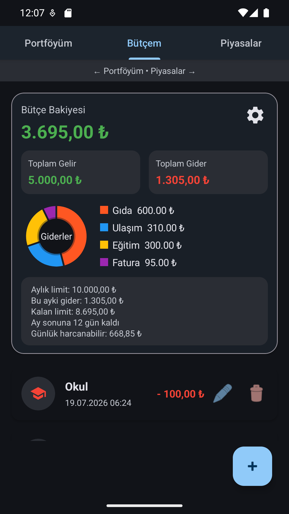
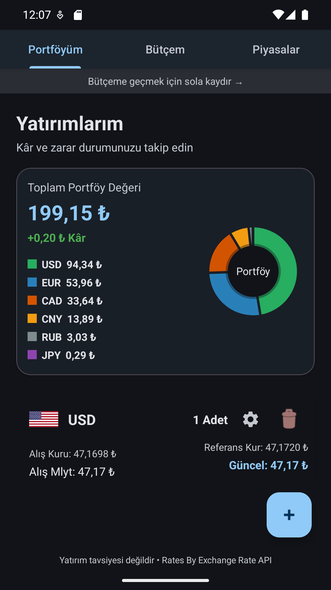
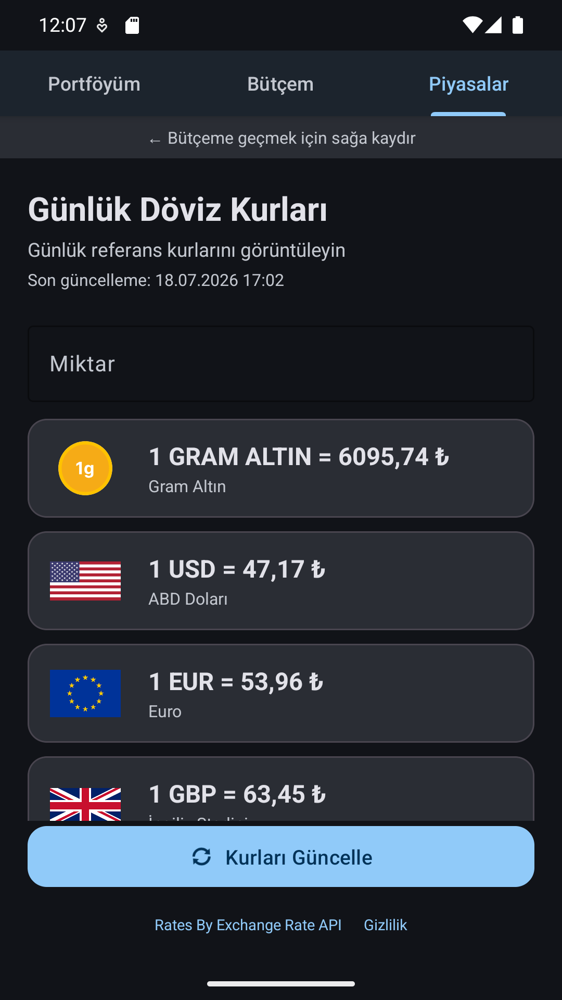

# VarlıkCep

VarlıkCep; gelir, gider, bütçe, birikim hedefi ve yatırım varlıklarını tek
uygulamada takip etmeye yardımcı olan, Kotlin ile geliştirilmiş yerel öncelikli
bir Android uygulamasıdır.

Uygulama ödeme, para transferi veya yatırım danışmanlığı hizmeti sunmaz.
Gösterilen döviz, altın ve portföy değerleri bilgilendirme amaçlı referans
verilerdir ve yatırım tavsiyesi değildir.

## Proje bilgileri

| Alan | Değer |
| --- | --- |
| Platform | Android 7.0 (API 24) ve üzeri |
| Dil | Kotlin |
| Arayüz | XML, Material Components, ViewBinding |
| Yerel veri | Room Database |
| Paket adı | `com.epatay.digitalwallet` |
| Sürüm | `1.1.0` (`versionCode 2`) |

## Özellikler

### Bütçe ve işlemler

- Gelir ve gider ekleme, düzenleme ve silme
- Pozitif tutar, sayı biçimi ve zorunlu alan doğrulaması
- Yalnızca listeden seçilebilen gider kategorileri
- Aylık bütçe, kalan bütçe ve günlük harcanabilir tutar hesaplaması
- Kategori bazlı bütçeler ve aylık raporlar
- Metin, kategori, işlem türü ve tarih aralığına göre arama ve filtreleme
- Düzenli gelir/gider tanımlama ve yaklaşan kayıt bildirimleri
- Birikim hedefi, para ekleme/çekme ve ilerleme takibi

### Piyasalar ve döviz çevirici

- TCMB günlük döviz alış ve satış kurları
- TL dönüşümleri ve USD→EUR gibi çapraz döviz hesaplamaları
- Son başarılı kur verisini Room üzerinde çevrimdışı gösterme
- Desteklenen para birimleri için uygulama paketindeki yerel PNG bayraklar
- İnternetten bayrak görseli indirmeyen çevrimdışı görsel yapı
- API Noktam üzerinden, Trunçgil Finans kaynaklı altın alış ve satış referans fiyatları
- Gram, çeyrek, yarım, tam ve Ata/Cumhuriyet altını için alış, satış, makas ve makas yüzdesi
- Döviz ve altın için ayrı Piyasalar sekmeleri

### Portföy

- Döviz ve altın varlığı ekleme, güncelleme ve silme
- Kullanıcının gerçek alış fiyatını elle girebilmesi veya piyasa satış fiyatını öneri olarak kullanabilmesi
- Piyasa alış/satış fiyatı, makas, toplam maliyet ve tahmini satış değeri takibi
- Tahmini satış değeri ile kâr/zarar hesaplama
- Dövizler için bayraklarla uyumlu sabit grafik renkleri
- Altın varlıkları için sarı grafik gösterimi
- Kullanıcı verilerini koruyan Room migration zinciri

### Dışa aktarma

- Microsoft Excel, Google Sheets ve LibreOffice ile uyumlu gerçek `.xlsx`
  çalışma kitabı
- UTF-8 ve doğru CSV escape kurallarıyla `.csv` dışa aktarma
- Gelir ve gider işlemleri için `.pdf` rapor
- Gelir, gider, kategori bütçesi, döviz yatırımı ve altın yatırımı sütunları
- Android Storage Access Framework ile kullanıcı tarafından seçilen konuma
  kaydetme
- Uygun MIME türleri ve güvenli stream/workbook kapatma

### Kullanıcı arayüzü

- Portföyüm, Bütçem ve Piyasalar için sabit alt navigasyon
- Sistem çubukları, klavye ve reklam alanını dikkate alan WindowInsets yapısı
- İçeriği kapatmayan ortak banner reklam alanı
- Responsive kartlar ve yatay taşma oluşturmayan ekran düzeni
- Klavye açıldığında sabit kalan alt navigasyon
- Uygulama içinden erişilebilen Yasal, Gizlilik ve yatırım uyarısı bağlantıları
- Türkçe karakterleri koruyan UI, Room, arama ve dışa aktarma akışları

## Veri kaynakları

- Döviz kurları: [Türkiye Cumhuriyet Merkez Bankası](https://www.tcmb.gov.tr/kurlar/today.xml)
- Altın referans fiyatları: [API Noktam](https://apinoktam.erenozdemir.com.tr/) / Trunçgil Finans
- Reklam: Google Mobile Ads SDK
- İzin tercihleri: Google User Messaging Platform

Piyasa verileri gecikebilir veya geçici olarak erişilemez olabilir. Uygulama bu
durumda Room'daki son başarılı veriyi **Son kaydedilen referans fiyat**
uyarısıyla gösterebilir. Kaynağın veri zamanı ile uygulamanın veriyi çektiği
zaman ayrı alanlardır.

### Alış, satış ve makas

- **Piyasa alış fiyatı**, kullanıcının varlığı bugün elden çıkarması hâlindeki
  tahmini değer için kullanılır.
- **Piyasa satış fiyatı**, yeni varlık formunda yalnızca önerilen alış fiyatıdır;
  kullanıcı gerçek birim alış fiyatını manuel girebilir.
- **Makas**, `satış - alış`; **makas yüzdesi** ise
  `(satış - alış) / alış × 100` olarak hesaplanır.
- Yeni bir yatırımın piyasa satış fiyatıyla kaydedilip piyasa alış fiyatıyla
  değerlenmesi nedeniyle makas kadar ekside başlaması normaldir; negatif sonuç
  gizlenmez veya yapay olarak sıfırlanmaz.

## Teknik yapı

- ViewModel ve Repository katmanları
- Room DAO, Flow ve StateFlow
- Kotlin Coroutines ve WorkManager
- Retrofit/OkHttp tabanlı HTTPS bağlantıları
- TCMB XML ayrıştırma katmanı
- MPAndroidChart grafik bileşenleri
- FastExcel ile OOXML `.xlsx` üretimi
- Android scoped storage ve Activity Result API

Ana kaynak dizinleri:

```text
app/src/main/java/com/epatay/digitalwallet/
├── data/       Room, ağ kaynakları, doğrulama ve hesaplama
├── export/     XLSX, CSV ve PDF dışa aktarma
├── recurring/  Düzenli kayıt ve bildirim işleri
└── ui/         Fragment, ViewModel ve adapter sınıfları
```

## Ekran görüntüleri

| Bütçem | Portföyüm | Piyasalar |
| --- | --- | --- |
|  |  |  |

## Kurulum

Gereksinimler:

- Güncel Android Studio
- JDK 17 veya üzeri
- Android SDK
- Android 7.0 veya üzeri cihaz/emülatör

Projeyi klonlayın:

```bash
git clone https://github.com/Hepatay/DigitalWalletApp.git
cd DigitalWalletApp
```

Projeyi Android Studio ile açmadan önce kökteki, Git tarafından yok sayılan
`local.properties` dosyasına Android SDK yolunun yanına API Noktam anahtarını
ekleyebilirsiniz:

```properties
sdk.dir=C\:\\Android\\Sdk
APINOKTAM_API_KEY=ak_live_ornek_degeri_buraya_yazin
```

Anahtar tanımlandığında uygulama kimlik doğrulamalı `/v1/altin` ucunu, anahtar
yokken anahtarsız demo ucunu kullanır. Ardından Gradle senkronizasyonunu
tamamlayıp `app` konfigürasyonunu çalıştırın. Canlı AdMob, API ve imzalama
değerleri repoya eklenmez; yerel yapılandırma dosyaları kullanılır.

Komut satırından doğrulama:

```bash
./gradlew testDebugUnitTest lintDebug assembleDebug
```

Windows:

```powershell
.\gradlew.bat testDebugUnitTest lintDebug assembleDebug
```

## Gizlilik

Finansal kayıtlar Room veritabanında kullanıcının cihazında saklanır. Hesap veya
bulut senkronizasyonu bulunmaz. Kullanıcı tarafından dışa aktarılan dosyalar,
yalnızca kullanıcının seçtiği konuma veya paylaşım hedefine yazılır.

- [Güncel gizlilik politikası](https://hepatay.github.io/DigitalWalletApp/)
- [Depodaki gizlilik politikası](docs/PRIVACY_POLICY_TR.md)
- [Üçüncü taraf bildirimleri](docs/THIRD_PARTY_NOTICES.md)

## Güvenlik

İmzalama anahtarları, parolalar, `local.properties`, `keystore.properties`,
`*.jks`, `*.keystore`, AAB ve APK dosyaları GitHub deposuna eklenmemelidir.

`local.properties`/`BuildConfig` kullanımı anahtarın kaynak depoda görünmesini
engeller; ancak bir mobil istemciye eklenen sır APK içinden kararlı bir
saldırgana karşı tamamen gizlenemez. Üretimde anahtar kısıtları, kota takibi,
düzenli rotasyon ve mümkünse sunucu tarafı aracı katman kullanılmalıdır.

Güvenlik veya gizlilik bildirimleri için
[GitHub Issues](https://github.com/Hepatay/DigitalWalletApp/issues) kullanılabilir.

## Yasal uyarı

VarlıkCep bankacılık, ödeme, kredi, aracılık veya yatırım danışmanlığı hizmeti
sunmaz. Döviz ve altın fiyatları ile portföy, kâr ve zarar hesapları kesin fiyat
veya alım-satım teklifi değildir. Kullanıcılar finansal kararlarını kendi
değerlendirmeleri ve gerektiğinde yetkili uzman görüşüyle vermelidir.

## Geliştirici

Hüseyin Epatay

[GitHub: @Hepatay](https://github.com/Hepatay)
